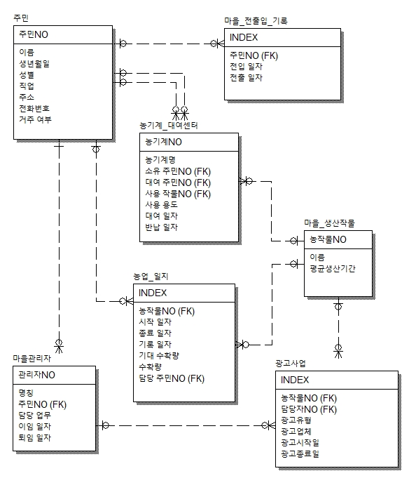
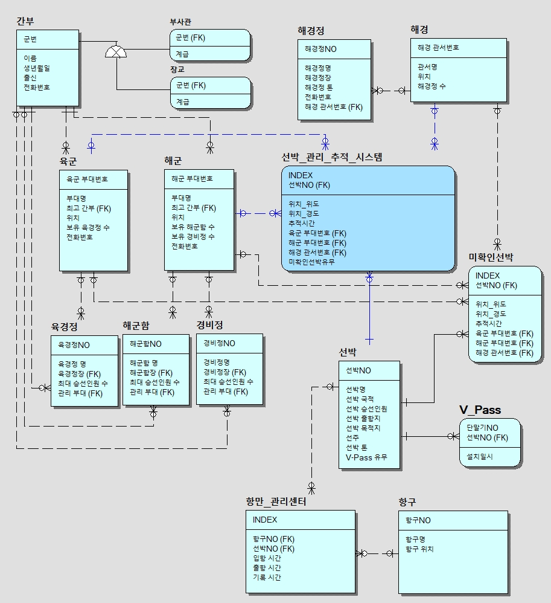

# Modeling

## FARM (농촌 관리 시스템)
- Data handling 연습 및 테이블 정규화를 위해 농촌 관리 시스템을 간단히 만들어 보았다.   

## Ship (선박 관리 추적 시스템)
- 선박 관리, 추적의 시스템화
- 군/경 합동 추적 및 관리
> 군/경의 개입이 필요한 이유   
> 외국 선박 : 다른 국적의 선박   
> 편의치적 선박 : 항해 간 편의를 위해 승선인원과 선박 국적이 다른 선박   
> 화물선, 여객선, 어선, 군/경 선박, 선외기 식별   
> 미확인 선박의 식별 및 유사 시 대비   
- 항만의 입/출항 관리
- 이 외 군청, 국립공원 등 다른 기관과의 관계도 및 data table도 필요할 것 같다.   

- 군생활 시절 완도 해안감시 복무 중 했던 선박식별, 추적, 관리 등에 영감을 얻어 선박 추적 관리 시스템과 그에 관련 된 기관들을 Modeling 및 정규화 해보았다.
- DataSet을 조금더 정밀하게 관리, 업무분담을 위해!      

- 이 후 미확인 선박을 선박추적시스템 안에 추가하고 table을 정규화 하는 것이 더 필요할 것 같다! (수정사항 필요)